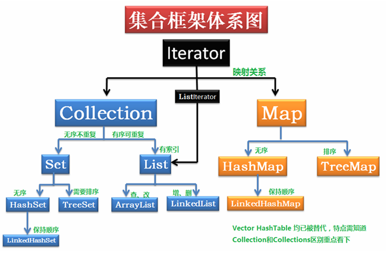

 ## 一、接口继承关系和实现
 * 集合类存放于 Java.util 包中，主要有 3 种：set、list和 map。  
 * 集合框架图：  
   
   
 &emsp;&emsp;上述类图中，实线边框的是实现类，比如ArrayList，LinkedList，HashMap等，虚线边框的是抽象类，比如AbstractCollection，
 AbstractList，AbstractMap等，而点线边框的是接口，比如Collection，Iterator，List等。  
 * 各集合对比：  
 
 
 
 ## 二、List
 * List是有序的集合，Java List一共有三个实现类：ArrayList、Vector、LinkedList  
 
 
   #### 1.ArrayList
   &emsp;&emsp;ArrayList 是最常用的 List 实现类，内部是通过数组实现的，它允许对元素进行快速随机访问。数
   组的缺点是每个元素之间不能有间隔，当数组大小不满足时需要增加存储能力，就要将已经有数
   组的数据复制到新的存储空间中。当从 ArrayList 的中间位置插入或者删除元素时，需要对数组进
   行复制、移动、代价比较高。因此，它适合随机查找和遍历，不适合插入和删除。  
   * 1.基于数组实现，是一个动态数组，其容量能自动增长。
   
   * 2.ArrayList不是线程安全的，建议在单线程中使用，多线程可以选择Vector或CopyOnWriteArrayList。
   
   * 3.实现了RandomAccess接口，可以通过下标序号进行快速访问。
   
   * 4.实现了Cloneable接口，能被克隆。
   
   * 5.实现了Serializable接口，支持序列化。 
    
   &emsp;&emsp;两个重要的属性elementData和size:  
   ~~~
   /**
     * The array buffer into which the elements of the ArrayList are stored.
     * The capacity of the ArrayList is the length of this array buffer. Any
     * empty ArrayList with elementData == DEFAULTCAPACITY_EMPTY_ELEMENTDATA({})
     * will be expanded to DEFAULT_CAPACITY(10) when the first element is added.
     */
   transient Object[] elementData; // non-private to simplify nested class access
   ~~~
   elementData: 保存了添加到ArrayList中的元素。实际上，elementData是个动态数组，我们能通过构造函数 
   ArrayList(int initialCapacity)来执行它的初始容量为initialCapacity；如果通过不含参数的构造函数ArrayList()来创建ArrayList，
   则elementData的容量默认是10。  
   size: 动态数组的实际大小。  
   
   扩容：
   ~~~
   private void grow(int minCapacity) {
       // overflow-conscious code
       int oldCapacity = elementData.length;
       int newCapacity = oldCapacity + (oldCapacity >> 1);
       if (newCapacity - minCapacity < 0)
           newCapacity = minCapacity;
       if (newCapacity - MAX_ARRAY_SIZE > 0)
           newCapacity = hugeCapacity(minCapacity);
       // minCapacity is usually close to size, so this is a win:
       elementData = Arrays.copyOf(elementData, newCapacity);
   }
   
   private static int hugeCapacity(int minCapacity) {
      if (minCapacity < 0) // overflow
          throw new OutOfMemoryError();
      return (minCapacity > MAX_ARRAY_SIZE) ?
          Integer.MAX_VALUE : MAX_ARRAY_SIZE;
   }
   ~~~
   针对三种情况对该方法进行解析：
   
   * 当前数组是由默认构造方法生成的空数组并且第一次添加数据。此时minCapacity等于默认的容量（10）
   那么根据下面逻辑可以看到最后数组的容量会从0扩容成10。而后的数组扩容才是按照当前容量的1.5倍进行扩容；
   * 当前数组是由自定义初始容量构造方法创建并且指定初始容量为0。此时minCapacity等于1那么根据下面逻辑可以看到最后数组的容量
   会从0变成1。这边可以看到一个严重的问题，一旦我们执行了初始容量为0，那么根据下面的算法前四次扩容每次都 +1，
   在第5次添加数据进行扩容的时候才是按照当前容量的1.5倍进行扩容。
   * 当扩容量（newCapacity）大于ArrayList数组定义的最大值后会调用hugeCapacity来进行判断。如果minCapacity已经大于Integer的最大值
   （溢出为负数）那么抛出OutOfMemoryError（内存溢出）否则的话根据与MAX_ARRAY_SIZE的比较情况确定是返回Integer最大值还是MAX_ARRAY_SIZE。
   这边也可以看到ArrayList允许的最大容量就是Integer的最大值（-2^31~2^31-1）。 
    
   #### 2.Vector
   &emsp;&emsp;Vector 与 ArrayList 一样，也是通过数组实现的，不同的是它支持线程的同步，即某一时刻只有一
   个线程能够写 Vector，避免多线程同时写而引起的不一致性，但实现同步需要很高的花费，因此，
   访问它比访问 ArrayList 慢。
   
   **Vector 特点**  
   * 底层由一个可以增长的数组组成
   * Vector 通过 capacity (容量) 和 capacityIncrement (增长数量) 来尽量少的占用空间
   * 扩容时默认扩大两倍
   * 最好在插入大量元素前增加 vector 容量，那样可以减少重新申请内存的次数
   * 通过 iterator 和 lastIterator 获得的迭代器是 fail-fast 的
   * 通过 elements 获得的老版迭代器 Enumeration 不是 fail-fast 的
   * 同步类，每个方法前都有同步锁 synchronized
   * 在 JDK 2.0 以后，经过优化，Vector 也加入了 Java 集合框架大家族
   
   **Vector VS ArrayList**  
   共同点：
   * 都是基于数组
   * 都支持随机访问（使用下标进行访问）
   * 默认容量都是 10
   * 都有扩容机制
   
   区别：
   * Vector 出生的比较早，JDK 1.0 就出生了，ArrayList JDK 1.2 才出来
   * Vector 比 ArrayList 多一种迭代器 Enumeration
   * Vector 是线程安全的，ArrayList 不是
   * Vector 默认扩容 2 倍，ArrayList 是 1.5  
   
   如果没有线程安全的需求，一般推荐使用 ArrayList，而不是 Vector，因为每次都要获取锁，效率太低。
   
   #### 3.LinkedList
   &emsp;&emsp;LinkedList 是用链表结构存储数据的，很适合数据的动态插入和删除，随机访问和遍历速度比较
   慢。另外，他还提供了 List 接口中没有定义的方法，专门用于操作表头和表尾元素，可以当作堆
   栈、队列和双向队列使用  
   
   **LinkedList 一些主要特性：**
   * 集合底层实现的数据结构为双向链表
   * 集合中元素允许为 null
   * 允许存入重复的数据
   * 中元素存放顺序为存入顺序。
   * 是非线程安全的，如果想保证线程安全的前提下操作 LinkedList，可以使用 
   List list = Collections.synchronizedList(new LinkedList(...)); 来生成一个线程安全的 LinkedList
   
   节点的实现：
   ~~~
   private static class Node<E> {
       E item;
       Node<E> next;
       Node<E> prev;
       Node(Node<E> prev, E element, Node<E> next) {
           this.item = element;
           this.next = next;
           this.prev = prev;
       }
   }
   ~~~
   
   * 链表批量增加，是靠for循环遍历原数组，依次执行插入节点操作。对比ArrayList是通过System.arraycopy完成批量增加的  
   * 通过下标获取某个node 的时候，（add select），会根据index处于前半段还是后半段 进行一个折半，以提升查询效率：
   ~~~
   /**
    * Returns the (non-null) Node at the specified element index.
    */
   Node<E> node(int index) {
       // assert isElementIndex(index);
       if (index < (size >> 1)) {
           Node<E> x = first;
           for (int i = 0; i < index; i++)
               x = x.next;
           return x;
       } else {
           Node<E> x = last;
           for (int i = size - 1; i > index; i--)
               x = x.prev;
           return x;
       }
   }
   ~~~
 
 ## 三、Set
 * Set 注重独一无二的性质,该体系集合用于存储无序(存入和取出的顺序不一定相同)元素，值不能重复。
 对象的相等性本质是对象 hashCode 值（java 是依据对象的内存地址计算出的此序号）判断的，
 如果想要让两个不同的对象视为相等的，就必须覆盖 Object 的 hashCode 方法和 equals 方法。  
   
   #### 1.HashSet
   **HashSet数据结构**
     
   HashSet内部使用HashMap来实现，HashMap的key为要存储的元素，value为一个Object，大致数据结构如下：  
   ~~~
   public class HashSet<E> 
       extends AbstractSet<E> 
       implements Set<E>, Cloneable, java.io.Serializable 
   {
       static final long serialVersionUID = -5024744406713321676L;
       private transient HashMap<E,Object> map;  
       private static final Object PRESENT = new Object();  
   }
   ~~~
   * serialVersionUID：常量，序列化所用的ID
   * map：使用HashMap来保存HashSet中所有元素，并使用transient关键字修饰，防止被序列化  
   * PRESENT：常量，默认为map的value值
   
   **小结**
   * 从源码来看，HashSet无非是一个阉割版的HashMap，所以要想明白HashSet的实现原理，HashMap源码必须搞懂。
   * 对于HashSet中保存的对象，请注意正确重写其equals和hashCode方法，以保证放入的对象的唯一性。
   * Set是利用底层的Map对于key不能重复的特性来保证元素的不重复的。
   * HashSet没有提供get()方法，原因是同HashMap一样，Set内部是无序的，只能通过迭代的方式获得。
   
   #### 2.TreeSet
   1.   TreeSet()（基于TreeMap实现）使用二叉树的原理对新 add()的对象按照指定的顺序排序（升序、降序），
   每增加一个对象都会进行排序，将对象插入的二叉树指定的位置。
   2.  Integer 和 String 对象都可以进行默认的 TreeSet 排序，而自定义类的对象是不可以的，
   自己定义的类必须实现 Comparable 接口，并且覆写相应的 compareTo()函数，才可以正常使用。
   3.  在覆写 compare()函数时，要返回相应的值才能使 TreeSet 按照一定的规则来排序
   4.  比较此对象与指定对象的顺序。如果该对象小于、等于或大于指定对象，则分别返回负整数、零或正整数。  
   
   关键属性：
   ~~~
   private transient NavigableMap<E,Object> m; // 保证有序
   
   // Dummy value to associate with an Object in the backing Map
   private static final Object PRESENT = new Object(); // 固定Value
   ~~~
   很明显，m是用来保存元素的，但m声明的是NavigableMap而不是TreeMap。可以猜测，TreeMap应该是在构造方法里实例化的，
   这里使用NavigableMap可以让TreeSet更加灵活。PRESENT和HashSet中的PRESENT作用一样，作为固定Value值进行占位的。
   
   **小结**
   * 基于TreeMap实现的，支持自然排序和自定义排序，可以进行逆序输出；
   * 不允许null值；
   * 不是线程安全的，多线程环境下可以使用SortedSet s = Collections.synchronizedSortedSet(new TreeSet(...));
   
   #### 3.LinkedHashSet
   对于 LinkedHashSet 而言，它继承与 HashSet、又基于 LinkedHashMap 来实现的。
   LinkedHashSet 底层使用 LinkedHashMap 来保存所有元素，它继承与 HashSet，其所有的方法
   操作上又与 HashSet 相同，因此 LinkedHashSet 的实现上非常简单，只提供了四个构造方法，并
   通过传递一个标识参数，调用父类的构造器，底层构造一个 LinkedHashMap 来实现，在相关操
   作上与父类 HashSet 的操作相同，直接调用父类 HashSet 的方法即可。